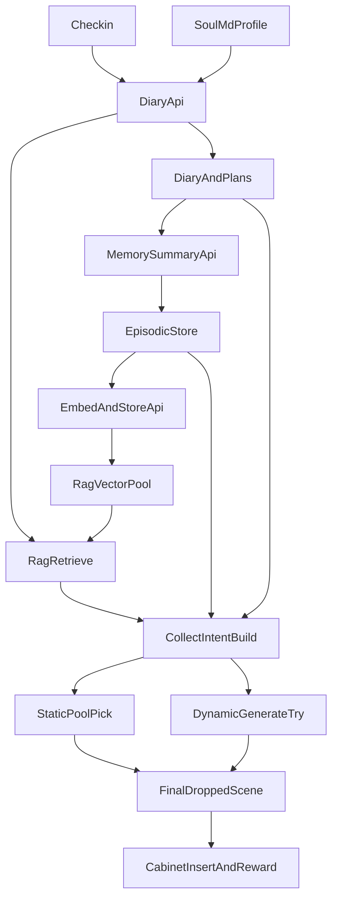

# SoulGo 负责人交付文档（提示词与收集物协作）

本文档用于给项目负责人做统一交付，目标是让非研发角色也能快速理解：
- 当前提示词都在做什么
- 记忆系统、RAG、核心档案如何协同
- 静态池与动态生成如何配合完成收集物发放

---

## 1. 一句话总览

SoulGo 的核心链路是两层协作：
- **决策层**：核心档案 + 记忆系统 + RAG，决定“这次该生成什么方向、什么语气、什么偏好”。
- **供给层**：静态池 + 动态生成，决定“最终给用户什么收集物，并且如何保证稳定性和新鲜感”。

---

## 2. 提示词总览（接口 -> 功能 -> 关键约束）

### 2.1 日记主生成：`POST /api/diary`
- 文件：`api/diary.js`
- 主要提示词：
  - `DIARY_SYSTEM_PROMPT_BASE`
  - `getSoulTextForPrompt(5500)`（将 `soul.md` 节选拼入系统提示）
  - `buildDiaryUserPrompt(...)`（把 date/location/episodicMemories/semanticTraits/semanticProfile/habitSummaries 作为上下文）
- 功能：
  - 输出统一 JSON：`title/content/moodTag/behaviorPlan/cabinetPlan/thinkingSteps`
  - 支撑打卡后的日记、行为规划、橱柜建议、思考解释
- 关键约束：
  - 必须返回合法 JSON
  - 正文 80~200 字
  - `behaviorPlan` 只允许固定 type 集合

### 2.2 记忆抽取：`POST /api/memory-summary`
- 文件：`api/memory-summary.js`
- 主要提示词：
  - `MEMORY_EXTRACTION_SYSTEM`
  - `getSoulShortBlurb(450)`（角色钉扎）
- 功能：
  - 从日记中抽取结构化记忆：`summary/emotion/key_facts`
  - 为前端记忆写入和向量检索提供可检索摘要
- 关键约束：
  - 只输出 JSON：`{"summary":"...","emotion":"...","key_facts":[...]}`
  - `emotion` 限定枚举：`excited/tender/curious/nostalgic/calm`

### 2.3 日记插图点评：`POST /api/diary-image-comment`
- 文件：`api/diary-image-comment.js`
- 主要提示词：
  - `IMAGE_COMMENT_SYSTEM_BASE`
  - `getSoulShortBlurb(1000)`（角色摘要增强）
  - `buildUserText(...)`（注入人格、称呼、地点、日记片段）
- 功能：
  - 对用户插图输出“陪伴式短评”
- 关键约束：
  - 输出纯中文正文，不要 JSON/Markdown/标题
  - 长度约 40~120 字

### 2.4 宠物行为决策：`POST /api/pet/decide`
- 文件：`api/pet/decide.js`
- 主要提示词：
  - `SYSTEM_PROMPT_BASE`
  - `getSoulShortBlurb(380)`
  - `buildUserPrompt(...)`（心情、健康、当前状态、最近行为）
- 功能：
  - 在固定意图集合中选择 1 个动作意图
- 关键约束：
  - 只输出一行 JSON：`{"intent":"...","reason":"..."}`
  - `intent` 必须在白名单内

### 2.5 动态收集物：`POST /api/generate-collectible`
- 文件：`api/generate-collectible.js`
- 主要提示词：
  - `stylePrompt(styleType, location, memoryTag)`
  - `IMAGE_TEXT_RULE`（禁止文字）
- 功能：
  - 按 food/sculpture/badge 生成旅行收集物图
  - 成功后可落盘进 `场景/generated/aigc-cutouts/` 并更新 manifest
- 关键约束：
  - 图中禁止任何可读文字
  - 结果以 `scene` 结构返回并可进入橱柜

### 2.6 日记配图与徽章图：`POST /api/generate-image`
- 文件：`api/generate-image.js`
- 主要提示词来源：
  - 前端 `index.html` 的 `generateImageForDiary(...)` 组装 `prompt`
  - 服务端再拼接前缀规则（默认禁文字，travel_badge 模式允许特定 ribbon 地名）
- 功能：
  - 生成日记插图或旅行徽章图
- 关键约束：
  - 默认模式无文字
  - travel_badge 模式仅允许指定地名文本

### 2.7 家具生成：`POST /api/generate-furniture`
- 文件：`api/generate-furniture.js`
- 主要提示词：
  - `imagePrompt`（地点灵感 + isometric 风格 + 禁文字）
- 功能：
  - 生成单件家具/装饰物图
- 关键约束：
  - 纯视觉，不允许文字元素

### 2.8 透传代理：`POST /api/chat`
- 文件：`api/chat.js`
- 说明：
  - 不内置固定提示词，直接透传调用方的 `messages`

---

## 3. 记忆系统 + RAG + 核心档案的协作关系

### 3.1 职责分工
- **核心档案（`soul.md`）**：统一角色设定与长期语气边界。
- **记忆系统（前端 appState + 结构化摘要）**：记录用户经历，形成连续上下文。
- **RAG（`/api/embed-and-store` + `/api/retrieve`）**：把历史经历变成可召回信息，在新一轮生成时提供相关记忆证据。

### 3.2 典型执行链路
1. 打卡触发 `POST /api/diary`。
2. 日记生成前，后端先基于地点/性格/习惯等发起检索，拿到 `episodicMemories`。
3. `soul.md` 节选 + 检索回来的记忆 + 前端人格快照共同进入提示词。
4. 生成日记与 `cabinetPlan/thinkingSteps`。
5. 前端再调用 `POST /api/memory-summary` 抽取 `summary/emotion/key_facts`。
6. 抽取结果写入本地 episodic 记忆，并异步调用 `POST /api/embed-and-store` 写向量库。
7. 下一次生成时继续被检索，形成闭环。

### 3.3 负责人可讲口径
- “核心档案保证角色不漂移。”
- “记忆系统保证内容不失忆。”
- “检索机制保证生成不是凭空编，而是带依据地回忆。”

---

## 4. 静态池 + 动态生成的配合关系

### 4.1 触发条件
- 文件：`index.html`（打卡主流程）
- 规则：
  - 先标准化地点（`normalizeLocationName`）
  - 若该地点已在 `appState.collectibleLocations` 中，则本次跳过收集物逻辑
  - 只有“新地点”才进入掉落流程

### 4.2 执行顺序（先稳后新）
1. `ensureBadgeManifestLoaded()`：先确保静态清单已就绪。
2. `getDroppedScene(...)`：从静态池挑选候选（含人格偏好、memoryTag、RAG 信号加权）。
3. `tryGenerateDynamicCollectible(...)`：按 tier 概率尝试动态生成。
4. 若动态成功，覆盖静态结果。
5. 若仍无结果且为中国地点，强制再试一次动态（`force: true`）。

### 4.3 入账与展示条件
- 仅当以下条件都满足才真正入橱柜：
  - 有 `droppedScene`
  - 橱柜未满（`CABINET_SLOTS`）
  - 不是重复物品（`findCabinetItem` 去重）
- 满足后执行：
  - `addCabinetItem(...)`
  - 更新 `collectibleLocations`
  - `showRewardModal(...)`

### 4.4 设计目的
- **静态池**：保证稳定性与可控质量（演示友好）。
- **动态生成**：提供个性化与新鲜感（避免内容同质化）。
- **强制兜底**：降低“新地点却无掉落”的体验风险。

---

## 5. 端到端关系图（负责人答疑版）

---

## 6. 负责人可直接复述的话术（高度提炼）

SoulGo 不是单次聊天产品，而是“角色设定 + 用户记忆 + 检索增强 + 双引擎内容供给”的持续体验系统。我们先用核心档案保证角色稳定，再用记忆与检索确保每次生成有历史依据；在内容供给上，静态池保证质量和稳定，动态生成提供个性化和新鲜感。最终用户获得的是可解释、可积累、可复访的体验，而不是一次性的随机输出。

---

## 7. 负责人排查清单（演示前）

- 环境变量：
  - `OPENROUTER_API_KEY`
  - （如用向量检索）`GOOGLE_GENERATIVE_AI_API_KEY`
- 静态资源可访问：
  - `场景/generated/pet-home-assets/manifest.json`
  - `场景/generated/badges/manifest.json`
  - `场景/generated/aigc-cutouts/manifest.json`
- 核心档案可访问：
  - 根路径 `soul.md`
- 演示路径建议：
  - 使用“新地点”打卡，避免重复地点导致不掉落
- 若无掉落：
  - 先看是否重复地点
  - 再看橱柜是否满
  - 再看动态接口 `/api/generate-collectible` 是否可用

---

## 8. 结论

这套方案把“稳定输出”和“个性化新鲜感”拆开治理：决策层负责相关性与一致性，供给层负责可用性与惊喜感。对负责人来说，讲价值时强调“持续积累的用户资产”，讲技术时强调“可解释与可控的生成闭环”。
